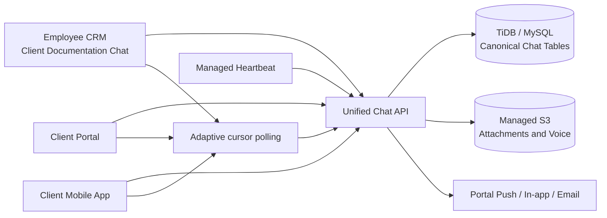

# ELEVAY Unified Client Chat — Technical Implementation Plan

**Prepared for:** ELEVAY Citizenship & Residency
**Prepared on:** 10 September 2026
**Status:** Approved architecture using adaptive polling on the existing Autoscale hosting.

**Implementation review — 12 September 2026:** The canonical schema, shared staff/portal service, CRM Chat tab, staff Expo mobile screen, advanced message controls, bounded multi-file media queues, voice transcripts, unread summaries, notification preferences, assignment, governance, moderation, exports, and Heartbeat-backed scheduled messages are implemented and validated. All 24 existing Client Documentation folders now have exactly one conversation. The cohesive web milestone is published in checkpoint `397fa5c1`; the connected staff mobile repository is updated through commit `bd6c69e`.

## 1. Executive Summary

ELEVAY already has separate staff-to-staff chat, Client Portal messages, and an unrelated WhatsApp monitoring module. The requested feature must not merge these destructively or expose one client’s data to another. The proposed design adds a new **authoritative ELEVAY conversation per Client Documentation folder** and migrates existing Client Portal messages idempotently.[1] [2]

The new conversation will appear as a **Chat** tab inside each Client Documentation record. The same authorized conversation will be available through the Client Portal and mobile client. Internal notes remain in the same operational thread for staff but are excluded from every client-facing query, real-time event, notification, and search result.[2] [3] [4]

> The system will use TLS/WSS and encrypted managed storage, but it will **not** be described as end-to-end encrypted. The server must process messages for authorization, audit, search, notifications, and document saving.

> **No WhatsApp integration:** the new chat is owned and operated entirely by ELEVAY. It will not send through WhatsApp, import WhatsApp conversations, depend on the WhatsApp Web bridge, or mirror WhatsApp messages. “WhatsApp-like” refers only to the familiar user experience and feature set.

## 2. Current-State Findings

The current Client Documentation detail page already owns the client folder, application stage, consultant, paralegal, documents, payments, and portal assignment. It is the correct employee-side host for the new Chat tab.[4] The main Client Documentation page is the correct place for unread counts, last-message previews, waiting indicators, and conversation assignment summaries.[5]

| Existing capability | Current implementation | Reuse decision |
| --- | --- | --- |
| Client-folder identity | `clientCases.id` | Becomes the unique conversation owner |
| Portal access | `clientPortalApplications` maps active portal users to client cases | Reuse as the client authorization boundary |
| Portal messages | `clientPortalMessages` with client/internal visibility | Backfill into the new canonical message store; keep legacy rows during rollback window |
| Portal documents | `clientPortalDocuments` with S3 key and client visibility | Reuse for document-to-chat attachment references |
| Staff chat | `chatMessages`, peer-to-peer only | Keep separate; it is not client-folder communication |
| WhatsApp module | Separate operational module | Remains completely independent and out of scope for this chat system |
| Client notifications | Portal notification, push, email, and outbox services | Reuse with chat-specific idempotency keys and preferences |
| Audit | CRM audit plus portal audit logs | Add append-only chat events and continue existing security logs |

The existing portal message model has no multi-party participant table, per-recipient receipts, edit/delete state, reactions, presence, reply threading, rich attachment model, or real-time transport. The employee and portal endpoints currently rely on request/response queries, so the requested cross-device immediacy requires a dedicated real-time layer.[1] [2] [3]

## 3. Approved Hosting and Synchronization Decision

The user selected **adaptive polling on the existing Autoscale hosting**. No Reserved Hosting upgrade, WebSocket server, external pub/sub service, or WhatsApp dependency will be introduced.

| UI state | Polling behavior | Target freshness |
| --- | --- | --- |
| Conversation open and page visible | Cursor-based message/receipt poll every 2 seconds | New message or receipt normally visible within 0–2 seconds |
| User is actively typing | Typing heartbeat written at most every 4 seconds; participant typing state polled with the open conversation | Approximate typing indicator; expires after 7 seconds without refresh |
| Client Documentation list visible | Conversation summary and unread counts every 10 seconds | New unread/list status normally visible within 0–10 seconds |
| Browser tab hidden or mobile app backgrounded | Suspend intensive polling; rely on push/in-app notification and refresh immediately on resume | Preserves battery and request capacity |
| Reconnected after offline period | Full delta synchronization from the last durable message/event cursor | No message loss; idempotent retry prevents duplicates |

Messages, receipts, typing freshness, and presence timestamps remain database-backed. Optimistic UI makes the sender’s message appear immediately, while the server response replaces the pending item with the durable record. “Online” will mean recent authenticated activity rather than an exact persistent socket connection.

## 4. Proposed Architecture

The **database is the source of truth**. Every send validates access, inserts the message with a unique idempotency key, creates required receipt/audit rows, commits, and returns the durable event. Other participants receive the event through the next cursor-based poll or notification-driven refresh.

## 5. Proposed Database Design

All changes are additive. Existing `chatMessages`, `clientPortalMessages`, and `waMessages` remain intact during migration and rollback.

| Table | Purpose and essential fields |
| --- | --- |
| `client_chat_conversations` | One row per `clientCaseId` with unique constraint; public ID; primary portal application; status; assignment; last message; waiting state; created/updated timestamps |
| `client_chat_participants` | Conversation membership for staff or portal users; role; active/revoked status; send/view/internal-note permissions; mute; notification preferences; last seen; unique participant mapping |
| `client_chat_messages` | Public ID; conversation; client-generated idempotency ID; source channel; sender identity; visibility; message type; text; reply target; edited/deleted state; importance; pin; server timestamp |
| `client_chat_message_receipts` | Unique message/participant row with sent, delivered, read, and listened timestamps plus device/session metadata |
| `client_chat_attachments` | Message link; opaque S3 key; generated safe filename; original filename; MIME; signature; size; checksum; preview metadata; scan/quarantine state; saved-document link |
| `client_chat_reactions` | Unique participant/message/reaction mapping with timestamps |
| `client_chat_audit_events` | Append-only administrative record for every security-sensitive chat action; never stores full message bodies or credentials |
| `client_chat_drafts` | Per-participant draft text and reply context, isolated by conversation |
| `client_chat_scheduled_messages` | Approved scheduled message, sender, due time, status, and managed Heartbeat task UID |
| `client_chat_settings` | Admin-controlled limits, edit/delete windows, receipt rules, presence visibility, retention, storage quota, templates, escalation targets |

### Migration and Cutover

1. Create new tables and indexes without altering existing message tables.
2. Create one conversation per existing Client Documentation folder.
3. Add participants from active portal assignments plus authorized consultant/paralegal/administrator relationships.
4. Backfill `clientPortalMessages` idempotently using a unique legacy source key.
5. Verify row counts, client ownership, visibility, and attachment references.
6. Switch portal and employee writes to the unified service while dual-reading for a controlled validation window.
7. Switch reads to the canonical conversation after parity is proven.
8. Retain legacy tables for rollback; do not drop or rewrite them in this release.

## 6. Authorization and Security Model

Authorization is enforced on every query, mutation, message action, receipt update, notification, and file download. An authenticated session never grants blanket conversation access. Requests use explicit schemas, bounded payloads, rate limits, session validation, and security-event logging.[7]

| Actor | Conversation access | Client-visible content | Internal notes | Administration |
| --- | --- | --- | --- | --- |
| Client Portal / mobile client | Active portal assignment to the exact client case; active account/session | Yes | Never | No |
| Assigned consultant/paralegal | Active staff account plus case assignment or explicit participant membership | Yes | Yes | Limited to allowed actions |
| Authorized manager/admin | Role/page permission plus conversation access policy | Yes | Yes | Assignment, settings, audit, reports |
| Unassigned employee | Denied by backend even if IDs or URLs are altered | No | No | No |

Critical controls include exact ID relationship checks, no client identifiers in authorization decisions without verified assignment joins, short-lived authenticated download resolution, safe text rendering, Zod schemas, database parameterization, per-user and per-conversation rate limits, message-size limits, logout/session revocation, WSS origin allowlisting, and privacy-safe logs.

The upload pipeline will allow only approved business formats, validate extension, MIME, decoded size, and file signature, generate opaque storage keys, quarantine unverified content, and keep files outside the webroot. OWASP recommends defense in depth because MIME or signature validation alone is insufficient.[8] Until a private malware scanner is approved, macro-enabled Office files, archives, and executable formats will remain blocked.

## 7. Adaptive Polling Protocol and Reliability

The tRPC and Client Portal REST APIs are authoritative for sending, history, pagination, receipts, typing freshness, attachments, administration, and recovery.

| Client action | Required server behavior |
| --- | --- |
| Open conversation | Revalidate participant membership and return an initial page plus durable cursor |
| Poll delta | Return only messages, edits, deletions, reactions, receipts, and typing updates newer than the caller’s cursor |
| Send message | Validate, rate-limit, deduplicate by client ID, persist transactionally, acknowledge durable message ID |
| Mark read | Upsert per-participant receipt and make the new receipt available in the next delta poll |
| Mark voice listened | Record listened timestamp once per participant and expose the aggregate authorized state |
| Typing heartbeat | Store/update a short-lived participant typing timestamp; ignore excessive refreshes |
| Activity heartbeat | Update `lastSeenAt` at a bounded frequency and obey presence privacy settings |

On reconnect, the client sends its last durable cursor. The server returns every missed event in order. The local pending queue retains unsent text and upload state, and each retry uses the same client-generated idempotency ID to prevent duplicates. If a cursor is invalid or expired, the client reloads paginated authoritative history.

## 8. Attachments, Voice, and Client Documents

Files are uploaded to managed S3 through server-side authorization; the database stores metadata and opaque keys rather than file bytes. Download access is resolved only after checking conversation membership and message visibility.[6]

Voice notes use browser/mobile recording with WebM/Opus where supported and a compatible fallback such as M4A/AAC for iOS. The existing transcription service supports WebM, MP3, WAV, OGG, and M4A up to 16 MB. Transcription and Arabic/English translation are asynchronous enrichment: failure never blocks the original voice note.

**Save to Client Documents** creates a new protected Client Documentation record that references the original chat attachment, records the source message, category, actor, and timestamp, and notifies only the assigned consultant/paralegal according to preferences. The server rejects any destination client folder that differs from the message’s conversation case.

## 9. ERP, Portal, and Mobile Changes

| Surface | Required change |
| --- | --- |
| Client Documentation detail | Add a Chat tab with header, participant identity, status, search, composer, internal-note mode, attachments, voice, receipts, message actions, and document save/send |
| Client Documentation list | Add unread badge, last-message preview/time, waiting-on indicator, assigned employee, and response-time warning |
| Client Portal web/API | Replace legacy message reads/writes with the unified service; add pagination, receipts, typing, attachments, voice, search, and deep links while filtering internal content server-side |
| Client mobile | Use the same portal APIs and real-time channel; add native recorder/file picker, offline pending queue, push deep links, long-press information, and multi-device resync |
| Admin settings | Add role/communication permissions, file limits, edit/delete windows, receipts, presence, retention, templates, blocked users, reported messages, storage, audit, and escalation controls |
| Notifications | Add preference-aware, idempotent in-app/browser/mobile/email alerts with privacy-safe previews and exact conversation/message deep links |

If the iOS app is a web wrapper, ERP/portal responsive changes become available without an App Store rebuild. If the mobile client is compiled Expo/React Native code, the new native chat interface, recorder, deep links, and push behavior require a new mobile build and release.

## 10. Scheduled Work

End-user scheduled messages use the managed Heartbeat mechanism, never `setInterval` or `node-cron`. Each scheduled business row stores its task UID, the mounted callback authenticates the cron identity, looks up the row only by that trusted task UID, and uses a deterministic message retry identifier. The platform currently exposes recurring six-field cron expressions rather than a one-time expiry field; after the first successful delivery the durable row becomes `sent`, so retries and any later annual cron match return a harmless `already_sent` result and cannot create a duplicate message. Authorized users can cancel a pending job from the Chat schedule dialog.

## 11. Controlled Development Phases

| Phase | Deliverable | Release gate |
| ---: | --- | --- |
| 1 | Schema, authorization service, conversation creation, backfill framework, audit | Migration reviewed; no existing rows changed; access tests pass |
| 2 | Employee text chat inside Client Documentation, pagination, internal notes, unread/list indicators | Staff role and cross-client denial tests pass |
| 3 | Adaptive polling, optimistic UI, durable send acknowledgements, cursor replay, typing/presence freshness | Offline/retry/order/duplicate and polling-load tests pass |
| 4 | Client Portal and mobile same-conversation access, receipts, deep links | Portal/mobile ownership and internal-note isolation pass |
| 5 | Secure attachments, previews, voice notes, transcripts, Save to Client Documents | File-security, cross-client, and mobile media tests pass |
| 6 | Reply/edit/delete/reaction/pin/important/search/info/group receipts | Action windows and participant receipt tests pass |
| 7 | Notifications, mute, templates, scheduling, response targets, admin settings | Preference, idempotency, and cron tests pass |
| 8 | Conversation lifecycle reporting, response targets, exports, and administrative moderation | Reporting, privacy, audit, and export tests pass |
| 9 | Performance, security, backup/recovery, controlled production pilot | Load, audit, rollback, and no-mock-data acceptance pass |

Every phase receives focused tests, production build validation, a reviewed additive migration if needed, non-mutating browser checks, and a checkpoint before the next phase.

## 12. Testing and Acceptance

Testing will include message send/receive, ordering, idempotent retries, pagination, multi-device recovery, session expiry, role and assignment access, client isolation, internal-note isolation, delivery/read/listened receipts, reply/edit/delete rules, reactions, attachments, failed uploads, voice playback, Save to Client Documents, existing-document sending, notification deep links, offline queues, desktop/mobile responsiveness, and regressions across Client Documentation and Client Portal.

The final production pilot will use controlled test accounts and synthetic content only, followed by complete removal of test artifacts. No client message or file will be exposed in test logs, screenshots, audit summaries, or checkpoint text.

## 13. Expected Ongoing Costs and Limits

| Cost area | Expected behavior |
| --- | --- |
| Application hosting | Remains on the current Autoscale mode; no Reserved Hosting upgrade is required |
| Database traffic | Adaptive polling increases read requests; cursor queries, visibility-aware intervals, indexes, and delta limits are required to control load |
| Data egress | Driven mainly by attachment downloads, images, video, and voice playback |
| Object storage | Grows with attachment volume and retention; enforce per-file limits, user quotas, compression, and retention settings |
| Voice transcription/translation | Usage-based per processed audio duration/model; optional and failure-tolerant; exact monthly cost depends on volume |
| Push notifications | Reuses existing client portal push infrastructure; provider policy and delivery limits still apply |
| Malware scanning | Not currently available in the project; private scanning requires an approved scanner/integration and may add compute or vendor cost |

Polling is intentionally adaptive. Hidden/background clients do not continue high-frequency message polling, and summary pages use slower intervals than an open conversation. If sustained active-user volume later makes polling inefficient, the schema and cursor protocol can be retained while the transport is upgraded independently.

## 14. Rollback and Data Safety

All schema work is additive. Legacy portal rows remain unchanged during backfill, and the separate WhatsApp module is not modified. Each phase has feature flags and route-level cutover controls. A rollback disables new writes and restores legacy reads without dropping chat tables, deleting files, or rewriting existing Client Documentation records.

## 15. Decisions Required Before Implementation

1. **Malware scanning:** block high-risk formats initially, or approve a private scanner integration.
2. **Mobile delivery:** confirm whether the client app is a web wrapper or a separately compiled Expo/React Native app.
3. **Message windows:** approve edit and delete-for-everyone durations.
4. **Retention:** approve message/file retention and legal-hold policy.

## 16. Remaining Release Gap Matrix

| Area | Delivered state | Remaining work before final publication |
| --- | --- | --- |
| Existing folders | All 24 existing folders have exactly one conversation; new folders create one idempotently | Continue using the checked-in provisioner only for recovery verification; normal creation is automatic |
| Client surfaces | CRM staff web, Client Portal REST, portal administrator, and staff Expo mobile use the canonical service | A separate client-facing Home/My Applications UI repository was not found; the sanitized REST contract is ready, but that compiled client interface is not claimed as shipped |
| Message discovery | Text/date/sender/type/visibility/flag/mention filters, replies, edit/delete history, reactions, stars, importance, pins, reports, drafts, presence, and lifecycle controls are implemented | Filtered CSV export is not a separate action; the authorized full-conversation CSV export is available |
| Media | Five-file web/mobile queues, per-file states and retries, strict validation, private keys, protected previews, voice notes, transcripts, 500 MB conversation quota, and playback speeds are implemented | Private antivirus scanning is not integrated; macro-enabled, archive, executable, and unknown formats remain blocked |
| Save to Documents | The original secure object is linked to a confirmed checklist item with source message/attachment references, cross-folder checks, audit, and assigned-team internal notification | No destructive file copy or storage-key disclosure is used |
| Notifications | Duplicate-safe client and staff alerts, protected deep links, unread badges, staff email filtering, and staff/portal mute/channel preferences are implemented | Final push-link interaction inside a separate client app must be verified when that client UI repository is supplied |
| Administration | Assignment, lifecycle, waiting state, monitoring, quota, response target, report moderation, retention policy records, legal hold, CSV export, and scheduled messages are available inside the folder chat | The seven-year choice records policy only; no destructive retention purge is active |
| Security and integrity | Authorization, internal-note isolation, attachment controls, task-UID callbacks, count-only integrity checks, responsive checks, 103 cross-module tests, 30 focused chat tests, and mobile validation pass | A controlled live client-account pilot and any future private antivirus integration remain operational follow-up items |

### Safe Defaults Used Until Explicit Policy Changes

Messages and attachments will use **indefinite retention by default** so no client record is automatically destroyed. Legal hold will block any future retention action. High-risk executable, archive, macro-enabled, and unknown formats remain blocked. The current validator performs extension, MIME, signature, decoded-size, executable-header, filename, and checksum checks; it must not be described as antivirus or malware scanning until a private scanner is approved and integrated.

The existing **15-minute edit window** and **60-minute delete-for-everyone window** remain the initial operational defaults. Adaptive polling remains the only synchronization transport: 2 seconds for an open conversation, 5 seconds for message reconciliation, and 10 seconds for list/health summaries while visible.

## References

[1]: ../drizzle/schema.ts "Current ELEVAY chat, portal, WhatsApp, identity, and audit schemas"
[2]: ../server/clientPortalRoutes.ts "Client Portal authorization, message, notification, and document APIs"
[3]: ../server/clientPortalAdminRouter.ts "Internal Client Portal administration and staff reply procedures"
[4]: ../client/src/pages/ClientDocDetail.tsx "Client Documentation folder detail interface"
[5]: ../client/src/pages/ClientDocs.tsx "Client Documentation list and creation interface"
[6]: ../server/storage.ts "Managed S3 storage helpers"
[7]: https://cheatsheetseries.owasp.org/cheatsheets/Web_Service_Security_Cheat_Sheet.html "OWASP Web Service Security Cheat Sheet"
[8]: https://cheatsheetseries.owasp.org/cheatsheets/File_Upload_Cheat_Sheet.html "OWASP File Upload Cheat Sheet"
